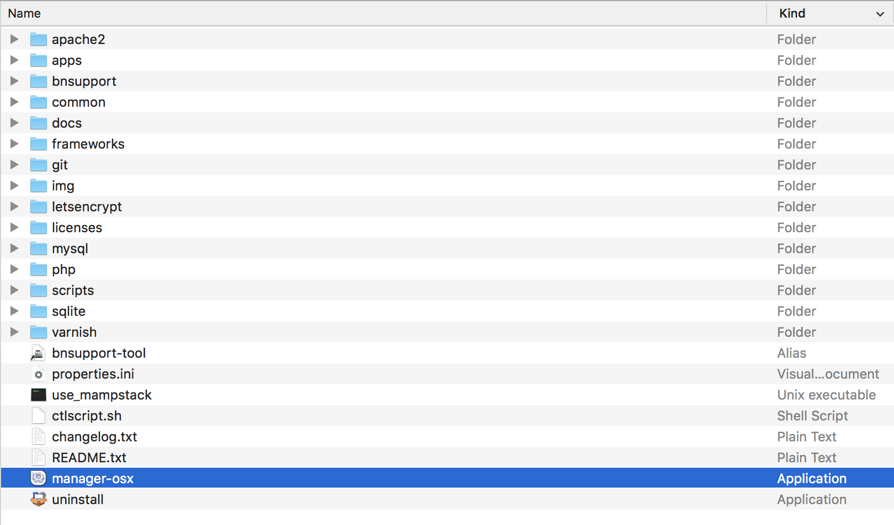

# Hypertube Search

Hypertube is a mock/clone movie streaming site where users can search for movies that they can either steam or download.  

The aim of this project, one of the Web projects from the 42 / WeThinkCode_ curriculum, is to develop a website and demonstrate the learning of the use/implementation of external APIs, oauthentication (external authentication), and torrent protocols. 

> NOTE - This is JUST THE SEARCH FUNCTIONALITY of the original Hypertube project, which can be found here:  
> https://github.com/CLetinic/Hypertube

 
# Installation

## Prerequisites
 
- An Apache server (in this case an bitnami local server)

### Apache Server
A local server to host on, in this case we will make use of bitnami local server environments

   - [Bitnami local server environments](https://bitnami.com/stacks/infrastructure)
   
##### MacOS

 - Install [Bitnami MAMP](https://bitnami.com/stack/mamp)

##### Windows

 - Install [Bitnami WAMP](https://bitnami.com/stack/wamp)

##### Linux
> NOTE - this project hasn't been tested on a linux based system

 - Install [Bitnami LAMP](https://bitnami.com/stack/lamp)

# Clone

Clone this repo to your local machine using:

```
cd [Insert path to your MAMP/ WAMP / LAMP Directory ]/apache2/htdocs
git clone https://github.com/CLetinic/HypertubeSearch.git
```

# Setup
## Configuring Server Environment

### Node Server
Start the Node server

```
cd [Insert path to your MAMP/ WAMP / LAMP Directory ]/apache2/htdocs/Hypertube/NODE
node app.js
```

### Apache Server
Locate and run the executable file



Configure Server port  
> NOTE - by default the server is set to port 80 we need to change it to 8080  


Start the server


Browse to site location

[http://localhost:8080/Hypertube](http://localhost:8080/Hypertube)

# Samples | Screenshots
## Landing | Home page  
<!--  -->

# APIs Used
## Movie APIs
- [TheMovieDB (TMDb)](https://www.themoviedb.org/documentation/api?language=en-US)
- [The Open Movie Database (OMDb)](http://www.omdbapi.com/)

# Project Insight
## Project Brief
- [Hypertube Project Brief](./misc/documents/hypertube.en.pdf)
## Project Markingsheet
- [Hypertube Project Marking sheet](./misc/documents/hypertube.markingsheet.pdf)
## Project Trello
- [Hypertube Trello Card](https://trello.com/c/Bq4ta9QG/31-hypertube)
- [Hypertube Trello Board](https://trello.com/b/EL93QDUO/hypertube-wethinkcode)
